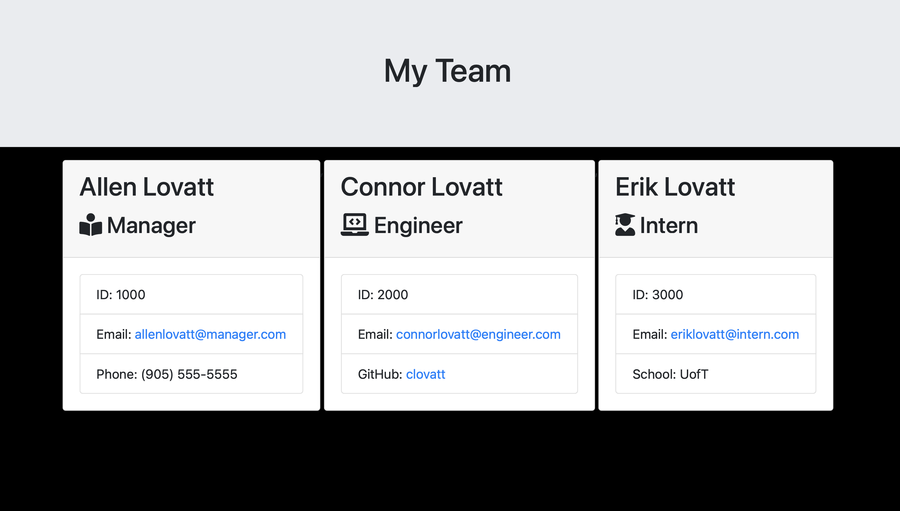

<h1 align="center">Team Profile Generator</h1>
  

## Description
Automatically generate Team Profile HTML pages.

## Table of Contents
- [Description](#description)
- [Installation](#installation)
- [Usage](#usage)
- [Screenshot](#screenshot)
- [Deployed](#deployed)
- [License](#license)
- [Contributing](#contributing)
- [Technologies](#technologies)
- [Testing](#testing)
- [Questions](#questions)
- [Contact](#contact)

## Installation
Install Node> execute in terminal: npm i > execute in terminal: node index.js

## Usage
Quickly compile an html document that contains detailed information about your team members. Enter information about your team manager, engineers or interns.

## Screenshot

 
 
Click on the GIF to redirect to HD video.
 

## Deployed
https://github.com/alovatt83/portfolio-generator

## License
This application is not covered under any coding licenses.

## Contributing
Visit our repository and request access to contribute.

## Technologies
HTML | CSS | JavaScript | NODE | Inquirer | Jest

## Testing
Tested on macOS Big Sur

## Questions
Report any discovered issues here: allenlovatt@gmail.com 
 

## Contact
Find me on GitHub: [Alovatt83](https://github.com/Alovatt83) 
 
Call me @: (905) 555-7295
 
Email me with any questions: allenlovatt@gmail.com  
